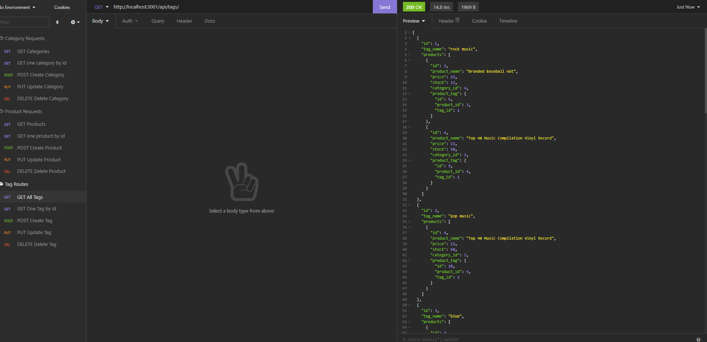
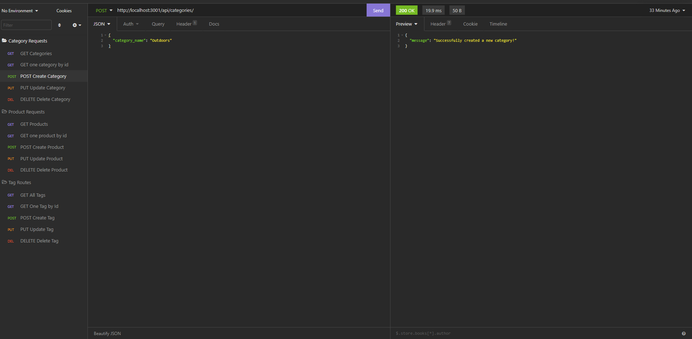

  # iCommerce

  

  ## Table of Contents
  -[Description](#description)

  -[Installation](#installation)

  -[Usage](#usage)
  
  -[Walkthrough](#walkthrough)

  -[License](#license)

  -[Contributions](#contributions)

  -[Questions](#questions)

  ## Description
  Back-end for an e-commerce site using an Express.js API and Sequelize to interact with a MySQL database.

  ## Installation
  Watch my Walkthrough Videos for an installation and usage walkthrough! 
  * Use <code>npm i</code> to install dependencies. 
  * Once that is done use <code>mysql -u root -p</code> to use MySQL for creating the database. 
  * Once in the MySQL terminal, use <code>SOURCE db/schema.sql;</code> to create the database, then use <code>exit</code> to exit the MySQL terminal. 
  * Next use <code>npm run seed</code> to actually add the data using the seeds files. 
  * After the data has been added use <code>npm start</code> to get the server up and running.

  ## Usage
  After getting the database created, seeded, and the server running, simply use the requests to retrieve the necessary data from the database as described in the Walkthrough Video.
   
   

  ## Walkthrough
  [Part 1](https://watch.screencastify.com/v/1wFwNKESZs921c6ngAxH) 
  [Part 2](https://watch.screencastify.com/v/1wFwNKESZs921c6ngAxH)
  ## License
 
  MIT License

  <https://choosealicense.com/licenses/mit/>

  ## Contributions
  Logan Hildebrandt

  ## Questions
  Contact me with any questions!

  Email: <hildebrandtlogan@gmail.com>

  Github: <https://github.com/LoganHild>
  
  LinkedIn: <https://www.linkedin.com/in/loganahildebrandt/>
